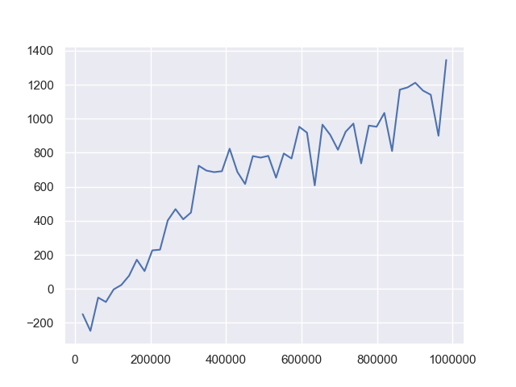
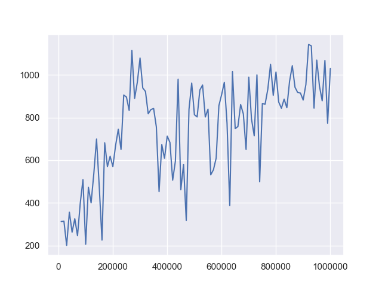
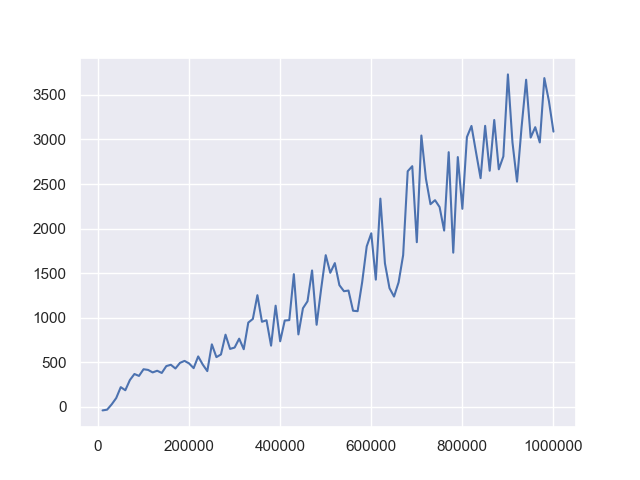
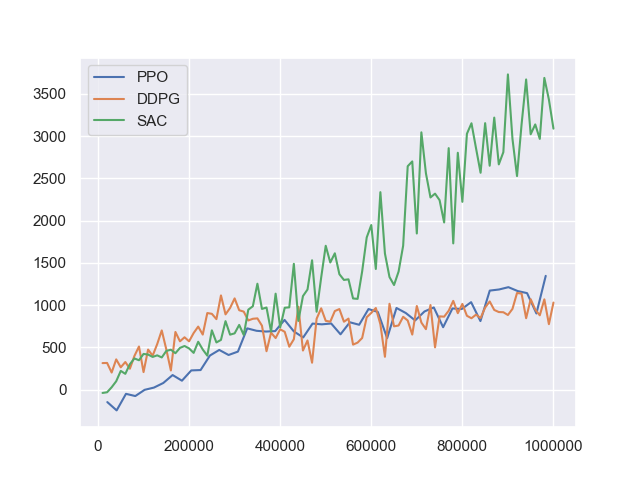

[](https://circleci.com/gh/takuseno/mvc-drl)
[](https://codeclimate.com/github/takuseno/mvc-drl/maintainability)
[](https://codeclimate.com/github/takuseno/mvc-drl/test_coverage)

# mvc-drl
Clean deep reinforcement learning codes based on Web MVC architecture with complete unit tests

## motivation
Implementing deep reinforcement learning algorithms is easy to make up messy codes because interaction loop between an environment and an agent requires a lot of dependencies among classes.
Even deep learning requires special skills to build clean codes.

To think out of the box, Web engineers spent years on studying MVC (model-view-controller) architecture to build systems with tidy codes to handle interaction between Web and users.
Here, I found that this MVC architecture is very useful insight even for deep reinforcement learning implementation.
MVC provides a direction to an architecture with less dependencies, which would be nicer for unit testing.

## installation
### nvidia-docker
You can use docker to setup and run experiments.
```
$ ./scripts/build.sh
```

Once you built the container, you can start a container with nvidia runtime via `./scripts/up.sh`.
```
$ ./scripts/up.sh
root@a84ab59aa668:/home/app#  ls
Dockerfile  README.md    example.confing.json  graphs            mvc      scripts  tests
LICENSE     examples     logs                  requirements.txt  test.sh  tools
root@a84ab59aa668:/home/app#
```

### manual
You need to install packages written in `requirements.txt` and tensorflow.
```
$ pip install -r requirements.txt
$ pip install tensorflow-gpu tensorflow-probability-gpu
```
If you have a problem of installing tensorflow probability, check tensorflow version.


### install as a library
This repository is also available on PyPI.
You can implement extra algorithms built on top of mvc-drl.
```
$ pip install mvc
```
:warning: This reposiotry is under development so that interfaces might be frequently changed.


## algorithms
For academic usage, we provide baseline implementations that you might need to compare.

- [x] Proximal Policy Optimization
- [x] Deep Deterministic Policy Gradients
- [x] Soft Actor-Critic

## Ant performance
Each point represents an average evaluation reward of 10 episodes.
Pretty much same performance has been achieved as a paper of [Soft Actor-Critic](https://arxiv.org/abs/1801.01290).

### PPO
```sh
$ python -m examples.ppo --env Ant-v2
```



### DDPG
```sh
$ python -m examples.ddpg --env Ant-v2
```



### SAC
```sh
$ python -m examples.sac --env Ant-v2 --reward-scale 5
```



### comparison


## log visualization
All logging data is saved under `logs` directory as csv files and visualization tool data.
Use `--log-adapter` option in example codes to switch tensorboard and visdom as visualization (default: tensorboard).

### tensorboard
```
$ tensorboard --logdir logs
```

### visdom
To use visdom, you need to fill host information of a visdom server.
```
$ mv example.config.json config.json
$ vim config.json # fill visdom section
```

Before running experiments, start the visdom server.
```
$ visdom
```

### matplotlib
You can visualize with `tools/plot_csv.py` by directly pointing to csv files.
```
$ python tools/plot_csv.py <path to csv> <path to csv> ...
```
By default, legends are set with paths of files.
If you want to set them manually, use `label` option.
```
$ python tools/plot_csv.py --label=experiment1 --label=experiment2 <path to csv> <path to csv>
```

## unit testing
To gurantee code quality, all functions and classes including neural networks must have unit tests.

Following command runs all unit tests under `tests` directory.
```sh
$ ./test.sh
```
